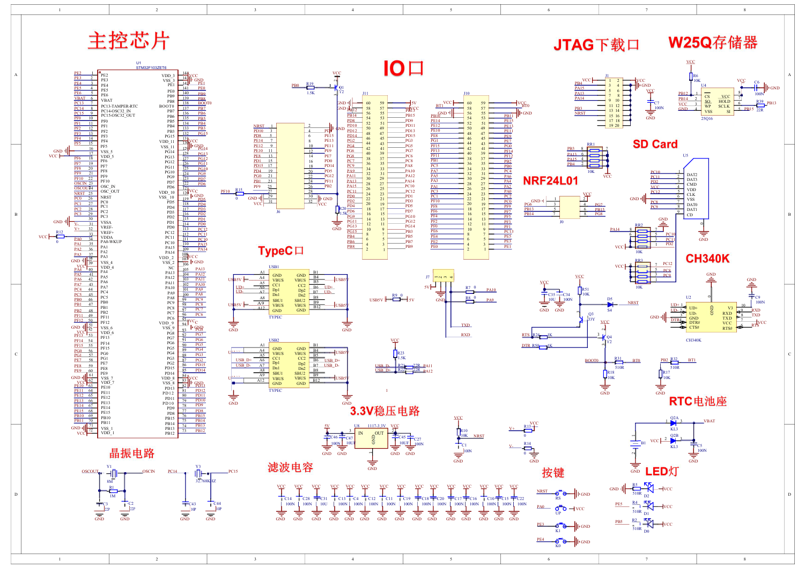

# stm32f103c8t6/zet6

#### 介绍
记录STM32学习过程

#### 软件架构
KELI5 MDK

#### 使用说明

1.  git clone 项目
2.  打开PRJ/点击绿色的图标
3. enjoy！

#### stm32f103ret6实训台节点原理图

1. 实训台节点原理图

2. 4G节点原理图

3. RFID节点原理图

#### stm32f103c8t6最小系统板原理图

##### 原理图：

##### 引脚定义图：

#### stm32f103zet6最小系统板原理图

##### 原理图：

